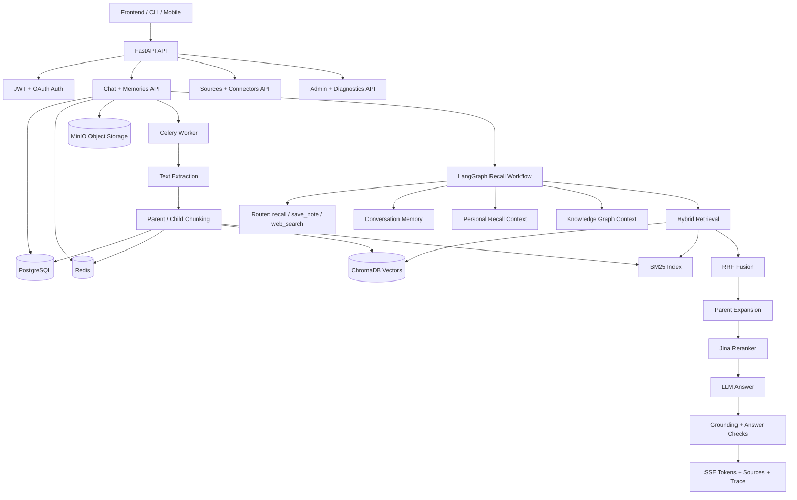

# MindLayer — Your Personal AI Second Brain

<p align="center">
  
  
  
  
  
  
</p>

**MindLayer** is a self-hosted, production-grade backend for a personal
AI second brain. It captures the things you read, write, clip, watch,
and listen to — articles, PDFs, notes, web clips, RSS, transcripts —
and turns them into a queryable, cited, memory-aware assistant that
runs entirely under your control.

It combines FastAPI, PostgreSQL, Redis, Celery, MinIO, ChromaDB, hybrid
retrieval, reranking, a LangGraph self-correcting recall workflow, a
personal knowledge graph (entities + relations), token-level SSE
streaming, evaluations, and a hardened operations surface.

This is not a "chat with your PDF" demo. It is structured as a
backend/AI engineering portfolio project that shows how a personal
RAG system can be built, tested, evaluated, and operated.

---

## Why This Exists

The internet hands us an endless stream of things worth remembering —
articles we want to revisit, papers we want to act on, snippets we
want to quote, notes we scribble in the middle of the night, and
conversations we want to come back to six months later. Browser
bookmarks, Notion pages, and Apple Notes all sit in their own
silos, none of them can answer "what did I read about X last March?",
and none of them cite their sources.

MindLayer is the retrieval layer underneath that workflow. You feed it
your sources (manually, by upload, by web clip, by RSS, by future
connectors), and it lets you:

- **Recall** — ask questions in natural language and get cited
  answers drawn from your own memory, not the open web.
- **Save notes** — drop a quick thought into the brain and have it
  surface later when the topic comes up.
- **Cluster** — discover themes, people, and projects through the
  built-in knowledge graph.
- **Stay private** — everything runs on your own infrastructure, with
  redacted mock services for any provider you do not configure.

---

## Feature Matrix

| Area | Capability |
| :--- | :--- |
| **Auth** | Email registration, OTP/link verification, login, refresh (hashed in Redis), logout, Google OAuth, onboarding. |
| **User lifecycle** | Profile endpoints, soft-delete-aware auth, verified/onboarded access gates. |
| **Sources** | Manual, file upload, web clipper connectors; `POST /sources/{id}/sync` dispatches the registered connector via `SourceSyncService`, surfaces per-source counts and errors. |
| **Memories** | Conversation-scoped uploads, MinIO storage, Celery ingestion, status polling, cleanup. |
| **RAG retrieval** | Parent-child chunking, OpenAI embeddings, ChromaDB vector search, BM25 lazy rebuild, RRF fusion, Jina reranking. |
| **Knowledge graph** | Entity and relation extraction, mention counts, related-entity traversal, cluster detection, graph snapshot for visualization. |
| **Agent workflow** | LangGraph routing (recall / save_note / web_search), memory loading, retrieval, relevance grading, answer generation, hallucination checks, bounded retries. |
| **Streaming** | `text/event-stream` status, token, sources, trace, done, and error events. |
| **Observability** | Agent trace metadata, retrieval timing, citation trace, `/ready`, admin-only diagnostics, Celery and ingestion visibility. |
| **Admin** | User/document/quota/settings management, document retry/delete, system stats, diagnostics. |
| **Quality** | 187 CI-safe tests passing, full-repo ruff clean, security readiness gate (`scripts/security_check.py`). |
| **Deployment** | Dockerized infra, production compose overlay, non-root Docker image, production config guardrails, runbooks. |

---

## Architecture at a Glance



Detailed architecture and demo docs:

- [ARCHITECTURE_OVERVIEW.md](file:///d:/DL/rag-backend/rag-backend/docs/ARCHITECTURE_OVERVIEW.md) — portfolio-friendly architecture overview
- [architecture.md](file:///d:/DL/rag-backend/rag-backend/docs/architecture.md) — detailed LangGraph node behaviour
- [RAG_TECHNIQUES.md](file:///d:/DL/rag-backend/rag-backend/docs/RAG_TECHNIQUES.md) — chunking, retrieval, reranking, and self-correction deep-dive
- [AI_ML_OVERVIEW.md](file:///d:/DL/rag-backend/rag-backend/docs/AI_ML_OVERVIEW.md) — model and prompt strategy
- [SECURITY_CHECKLIST.md](file:///d:/DL/rag-backend/rag-backend/docs/SECURITY_CHECKLIST.md) — security readiness checklist
- [SECURITY_EVIDENCE.md](file:///d:/DL/rag-backend/rag-backend/docs/SECURITY_EVIDENCE.md) — automated security audit evidence

---

## Recent Updates (2026-06)

The latest pass (Phase 1-3 remediation) hardened auth, sources, and
the test surface. See [CHANGELOG.md](file:///d:/DL/rag-backend/rag-backend/CHANGELOG.md)
for the full list. Highlights:

- Refresh tokens hashed in Redis with a per-user index set; O(1) revocation.
- Mock email no longer logs token-bearing HTML bodies (`EMAIL_MOCK_VERBOSE`
  opt-in for dev only).
- `/api/v1/sources/{id}/sync` now dispatches the registered connector
  through `SourceSyncService` instead of returning a stub.
- 187/187 unit tests pass; full-repo ruff is clean.

> [!NOTE]
> MindLayer was previously pitched as a multi-tenant SaaS support
> RAG. The codebase has been refocused on a single-user, self-hosted
> "Personal AI Second Brain" use case. See
> [REBRAND_NOTES.md](file:///d:/DL/rag-backend/rag-backend/docs/REBRAND_NOTES.md)
> for the brand pivot history.

---

## RAG Pipeline

### Ingestion

```text
Upload or sync a source (file, web clip, manual note, RSS, ...)
→ Store original artefact in MinIO
→ Queue Celery ingestion job
→ Extract text
→ Build parent and child chunks
→ Store metadata/chunks in PostgreSQL
→ Cache parent chunks in Redis
→ Embed child chunks into ChromaDB
→ Mark memory ready or failed
```

### Recall (Query)

```text
You ask a question
→ Rate limit and quota checks
→ Router classifies intent: recall | save_note | web_search
→ Memory loads conversation history
→ Personal context loads related memories
→ Knowledge graph injects related entities/relations
→ Conversation-scoped query cache lookup
→ Lazy rebuild BM25 in API process when needed
→ BM25 + vector retrieval
→ Reciprocal Rank Fusion
→ Parent expansion
→ Jina reranking
→ Stream answer tokens over SSE
→ Validate grounding and answer quality
→ Record retrieval timing, citation trace, and evaluator failure mode
→ Persist messages and agent trace
→ Emit sources, trace, and done events
```

---

## Demo Flow

The sample knowledge base in [sample_docs](file:///d:/DL/rag-backend/rag-backend/sample_docs)
contains mock personal "second brain" material — articles you've saved,
notes you've jotted, transcripts from podcasts, web clips, RSS items,
and PDFs from your reading list.

Suggested demo questions:

- "What did I save about RAG evaluation last week?"
- "Summarize the three articles I clipped about Postgres indexing."
- "What did the podcast transcript say about LangGraph retries?"
- "Which notes mention vector databases?"
- "What did I read about hybrid search in 2025?"

Use [DEMO_SCRIPT.md](file:///d:/DL/rag-backend/rag-backend/docs/DEMO_SCRIPT.md)
for a 5-minute walkthrough.

---

## API Overview

| Group | Examples |
| :--- | :--- |
| **Auth** | `POST /api/v1/auth/register`, `POST /api/v1/auth/login`, `POST /api/v1/auth/refresh`, `POST /api/v1/auth/exchange-code` |
| **Users** | `GET /api/v1/users/me`, `PATCH /api/v1/users/me`, `POST /api/v1/users/me/change-password` |
| **Chat (recall)** | `POST /api/v1/chat/conversations`, `GET /api/v1/chat/conversations/{id}`, `POST /api/v1/chat/conversations/{id}/message` |
| **Memories** | `POST /api/v1/chat/conversations/{id}/documents`, `GET /api/v1/chat/conversations/{id}/documents/{doc_id}` |
| **Sources** | `POST /api/v1/sources`, `POST /api/v1/sources/{id}/sync` |
| **Knowledge graph** | `GET /api/v1/graph/snapshot`, `GET /api/v1/graph/clusters`, `GET /api/v1/graph/related/{entity_name}` |
| **Admin** | `GET /api/v1/admin/users`, `GET /api/v1/admin/documents`, `POST /api/v1/admin/documents/{id}/retry`, `GET /api/v1/admin/stats` |
| **Diagnostics** | `GET /health`, `GET /ready`, `GET /api/v1/admin/diagnostics` |

Full endpoint matrix:

- [API_CAPABILITIES.md](file:///d:/DL/rag-backend/rag-backend/docs/API_CAPABILITIES.md)

---

## Chat SSE Event Contract

`POST /api/v1/chat/conversations/{id}/message` returns `text/event-stream` frames:

```text
event: status
data: {"type":"status","stage":"retrieval","retry_count":0}

event: token
data: {"type":"token","content":"MindLayer","retry_count":0}

event: sources
data: {"type":"sources","sources":[...]}

event: trace
data: {"type":"trace","agent_trace":{...}}

event: done
data: {"type":"done","sources":[...],"token_count":123,"retry_count":0}
```

Errors are emitted as:

```text
event: error
data: {"type":"error","message":"An error occurred."}
```

Manual streaming test:

```bash
curl -N \
  -H "Authorization: Bearer $ACCESS_TOKEN" \
  -H "Content-Type: application/json" \
  -X POST "http://localhost:8000/api/v1/chat/conversations/$CONVERSATION_ID/message" \
  -d '{"query":"What did I read about hybrid search in 2025?"}'
```

Frontend clients should append `token` event content to the visible answer,
display `status` retry events as progress indicators, and render `sources` and
`trace` after `done`.

---

## Quick Start

### 1. Install dependencies

```bash
python -m venv .venv
.venv\Scripts\activate
pip install -r requirements.txt -r requirements-dev.txt
```

### 2. Configure environment

```bash
copy .env.example .env
```

Update `.env` with OpenRouter, OpenAI-compatible embedding, Jina, database,
Redis, MinIO, and JWT values. Anything you leave empty falls back to a
self-contained mock (e.g. the email mock that no longer leaks token
bodies to logs).

### 3. Start infrastructure

```bash
docker compose up -d
```

### 4. Run migrations

```bash
alembic upgrade head
```

### 5. Start API and worker

Start the API:

```bash
uvicorn app.main:app --reload
```

Start the Celery worker in a second terminal. On Windows, use `--pool=solo`:

```bash
celery -A app.tasks.celery_app worker -Q default,ingestion,email --pool=solo -l INFO
```

Open API docs at: <http://localhost:8000/docs>

### 6. Run the demo smoke workflow

After the API and worker are running, execute the reusable smoke script:

```bash
python scripts/demo_smoke.py
```

The script seeds a verified/onboarded local user, logs in through the API,
creates a conversation, uploads sample sources, waits for ingestion, asks
the standard demo questions over SSE, and verifies answer tokens, sources,
and agent trace events.

For detailed local setup, see [LOCAL_RUN_GUIDE.md](file:///d:/DL/rag-backend/rag-backend/docs/LOCAL_RUN_GUIDE.md).

---

## Evaluation

The [eval](file:///d:/DL/rag-backend/rag-backend/eval) directory contains a
CI-safe offline evaluator and an optional live API evaluator.

Offline eval:

```bash
python eval/run_eval.py --mode offline --output-dir eval/results --top-k 5
```

Live API eval:

```bash
python eval/run_eval.py --mode live-api \
  --api-base-url http://localhost:8000 \
  --email eval-user@example.com \
  --password EvalPassword123! \
  --sample-docs sample_docs \
  --output-dir eval/results
```

Tracked metrics include source hit rate, keyword coverage, citation rate,
fallback accuracy, latency, hallucination flags, and self-correction rate.
See [EVALUATION_GUIDE.md](file:///d:/DL/rag-backend/rag-backend/docs/EVALUATION_GUIDE.md)
for the full methodology.

---

## Testing and CI

Fast checks that do not require external infrastructure:

```bash
python -m pytest --confcutdir=tests/config tests/config/test_settings_validation.py -q
python -m pytest --confcutdir=tests/api tests/api/test_health_api.py tests/api/test_sse.py tests/api/test_chat_streaming.py tests/api/test_admin_diagnostics.py -q
python -m pytest --confcutdir=tests/services tests/services/test_health_service.py tests/services/test_diagnostics_service.py -q
python -m pytest --confcutdir=tests/rag tests/rag/test_graph_routing.py tests/rag/test_evaluation.py tests/rag/test_integration.py tests/rag/test_ai_hardening.py -q
python -m pytest --confcutdir=tests/eval tests/eval/test_eval_metrics.py tests/eval/test_live_api_eval.py -q
```

Targeted lint used by CI:

```bash
python -m ruff check app/main.py app/config.py app/agents app/services/health_service.py app/services/diagnostics_service.py app/storage.py app/tasks/ingestion_tasks.py app/retrieval app/api/v1/chat.py app/api/v1/sse.py app/api/v1/admin.py eval/run_eval.py eval/live_api_eval.py eval/metrics.py eval/reporting.py tests/api/test_health_api.py tests/api/test_sse.py tests/api/test_chat_streaming.py tests/api/test_admin_diagnostics.py tests/api/conftest.py tests/rag/test_graph_routing.py tests/rag/test_evaluation.py tests/rag/test_integration.py tests/rag/test_ai_hardening.py tests/rag/conftest.py tests/services/test_health_service.py tests/services/test_diagnostics_service.py tests/services/conftest.py tests/eval/test_eval_metrics.py tests/eval/test_live_api_eval.py tests/config/test_settings_validation.py tests/integration
```

Full-repo lint and security readiness gate:

```bash
python -m ruff check app tests eval scripts
python scripts/security_check.py
```

Live integration tests are opt-in and expect Postgres, Redis, ChromaDB, and
MinIO services:

```bash
set RUN_LIVE_INTEGRATION=1
python -m pytest --confcutdir=tests/integration tests/integration -q
```

---

## Deployment and Operations

Production-like deployment and operations docs:

- [DEPLOYMENT_GUIDE.md](file:///d:/DL/rag-backend/rag-backend/docs/DEPLOYMENT_GUIDE.md)
- [OPERATIONS_RUNBOOK.md](file:///d:/DL/rag-backend/rag-backend/docs/OPERATIONS_RUNBOOK.md)
- [BACKUP_RESTORE.md](file:///d:/DL/rag-backend/rag-backend/docs/BACKUP_RESTORE.md)
- [SECURITY_CHECKLIST.md](file:///d:/DL/rag-backend/rag-backend/docs/SECURITY_CHECKLIST.md)

Use [docker-compose.yml](file:///d:/DL/rag-backend/rag-backend/docker-compose.yml)
for development and combine it with
[docker-compose.prod.yml](file:///d:/DL/rag-backend/rag-backend/docker-compose.prod.yml)
for production-like validation.

```bash
docker compose config --quiet
docker compose -f docker-compose.yml -f docker-compose.prod.yml config --quiet
```

Admin diagnostics are available at:

```text
GET /api/v1/admin/diagnostics
```

This endpoint summarizes dependency health, Celery reachability, secret-safe
runtime config, and ingestion status.

---

## Security and Reliability Highlights

- Production mode rejects placeholder JWT secrets, wildcard CORS, missing
  provider keys, and default MinIO credentials.
- CORS uses explicit origins instead of wildcard credentials.
- Refresh tokens are accepted through request bodies, not query parameters,
  and are stored in Redis as SHA-256 hashes (not the raw token). A per-user
  index set enables O(1) revocation on logout or password change.
- The email mock no longer logs token-bearing HTML bodies; the full body is
  opt-in via `EMAIL_MOCK_VERBOSE` (dev mode only).
- OAuth/email redirects use short-lived one-time exchange codes.
- Soft-deleted users are blocked by auth dependencies and login flows.
- Memory chunk DB fallback is scoped by conversation to prevent data leakage.
- Admin diagnostics are admin-only and secret-safe.
- Docker runtime uses a non-root app user.
- Production compose overlay removes reload/bind mounts and keeps infra
  ports internal by default.

---

## What This Project Demonstrates

- Self-hosted personal AI second brain with full data ownership
- Production-style FastAPI backend architecture
- Async SQLAlchemy and service-layer design
- Auth, OAuth, token refresh, onboarding, and admin authorization
- Background ingestion with Celery and Redis
- Object storage with MinIO
- Hybrid RAG retrieval beyond vector-only search
- Personal knowledge graph (entities, relations, clusters)
- Parent-child chunking, RRF, reranking, and self-correction loops
- Token-level SSE streaming and client-facing event contracts
- Evaluation tooling for offline and live API recall quality
- CI-safe tests plus opt-in live integration tests
- Deployment, operations, backup/restore, and security documentation

---

## Roadmap

Recommended next steps:

- Add a lightweight desktop or PWA front-end for daily capture.
- Wire additional connectors (Notion, Obsidian vault, Apple Notes, Gmail).
- Add a calendar- and RSS-driven auto-sync for hands-free ingestion.
- Surface a "memory of the week" digest from the knowledge graph.
- Add OpenTelemetry traces for end-to-end recall observability.
- Investigate on-device embeddings for a fully offline mode.