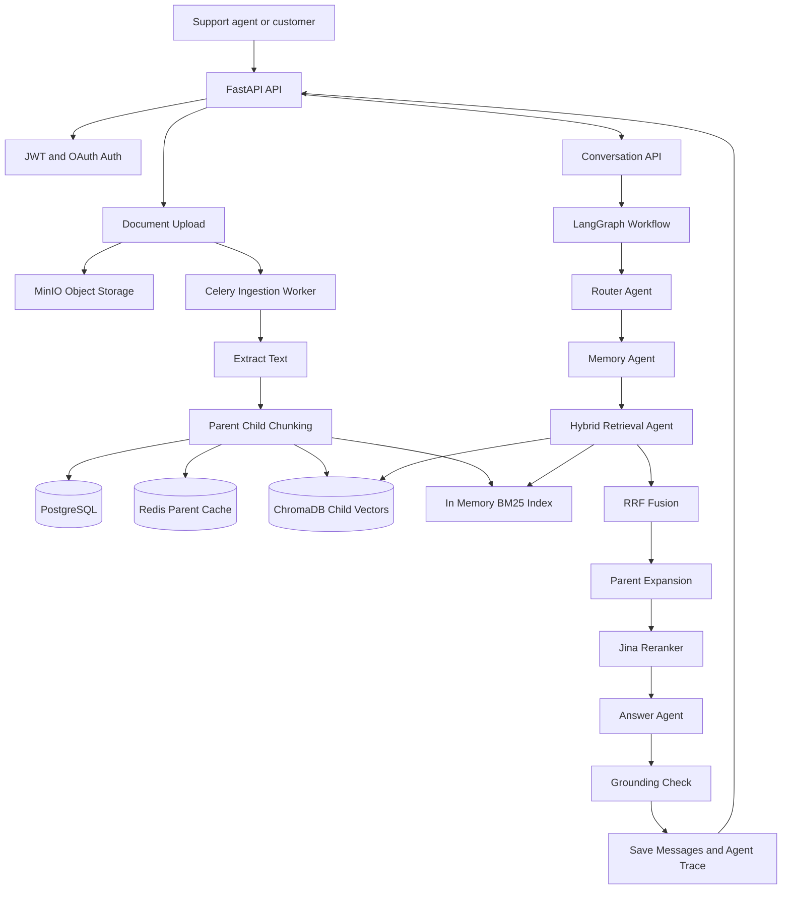

# SupportMind — Production RAG Backend for SaaS Support Teams

<p align="center">
  
  
  
  
  
</p>

**SupportMind** is a production-oriented RAG backend for SaaS support teams. It
helps support agents answer product, API, billing, integration, and
troubleshooting questions from internal knowledge-base documents with cited,
traceable answers.

This project is designed as a backend/AI engineering portfolio project, not a
single-file “chat with PDF” demo. It includes authentication, async document
ingestion, object storage, vector search, BM25, reranking, Redis caching,
Celery workers, admin APIs, and agent trace observability.

---

## Problem

SaaS support teams often need to search across product docs, API references,
billing FAQs, troubleshooting playbooks, release notes, and incident runbooks.
Answers can be slow, inconsistent, or hard to trace back to the source.

## Solution

SupportMind lets teams upload support knowledge-base documents and ask natural
language questions. The backend retrieves relevant context with hybrid search,
reranks the context, generates a grounded answer, and returns source metadata
plus an `agent_trace` for debugging retrieval quality.

---

## Key Features

| Feature | Description |
| :--- | :--- |
| **JWT + Google OAuth auth** | Register, verify email, login, refresh, logout, Google OAuth, onboarding. |
| **Async document ingestion** | Upload documents and process them in background workers with Celery. |
| **Parent-child chunking** | Parent chunks are returned to the LLM; child chunks are embedded for retrieval. |
| **Hybrid retrieval** | Dense vector search with ChromaDB plus lexical BM25 search fused by RRF. |
| **Reranking** | Jina reranker selects the most relevant support snippets. |
| **LangGraph workflow** | Router → memory → retrieval → relevance check → answer → hallucination check → save, with bounded self-correction retries. |
| **Agent trace** | Stores routing, retrieval, reranking, and answer metadata for observability. |
| **Admin APIs** | Manage users, documents, quotas, system settings, and audit logs. |
| **Dockerized infra** | PostgreSQL, Redis, Celery, ChromaDB, MinIO, Flower. |

---

## Tech Stack

- **API**: FastAPI, Pydantic, SQLAlchemy async
- **Database**: PostgreSQL + Alembic
- **Object Storage**: MinIO
- **Cache / Queue**: Redis + Celery
- **Vector DB**: ChromaDB
- **Retrieval**: OpenAI embeddings, BM25, Reciprocal Rank Fusion, Jina reranker
- **Agent Orchestration**: LangGraph
- **LLM Gateway**: OpenRouter-compatible OpenAI SDK
- **Testing / Tooling**: pytest, ruff, mypy

---

## Architecture



---

## RAG Pipeline

### Ingestion

```text
Upload support document
→ Store original file in MinIO
→ Celery worker extracts text
→ Build parent and child chunks
→ Store chunks in PostgreSQL
→ Cache parent chunks in Redis
→ Embed child chunks into ChromaDB
→ Build BM25 over parent chunks
→ Mark document as ready
```

### Query

```text
User asks support question
→ Router classifies intent and rewrites query
→ Memory loads recent conversation history
→ Retrieve with BM25 + vector search
→ Fuse results with Reciprocal Rank Fusion
→ Expand child chunks to parent context
→ Rerank with Jina
→ Generate cited answer
→ Save messages and agent trace
```

---

## API Overview

| Method | Endpoint | Description |
| :--- | :--- | :--- |
| `POST` | `/api/v1/auth/register` | Register with email/password. |
| `POST` | `/api/v1/auth/login` | Login and receive access/refresh tokens. |
| `POST` | `/api/v1/auth/refresh` | Refresh token using request body. |
| `POST` | `/api/v1/auth/exchange-code` | Exchange OAuth/email redirect code for tokens. |
| `POST` | `/api/v1/chat/conversations` | Create support conversation. |
| `POST` | `/api/v1/chat/conversations/{id}/documents` | Upload support document. |
| `GET` | `/api/v1/chat/conversations/{id}/documents/{doc_id}` | Check ingestion status. |
| `POST` | `/api/v1/chat/conversations/{id}/message` | Ask a question via SSE response. |
| `GET` | `/api/v1/admin/stats` | Admin system statistics. |
| `GET` | `/health` | Basic liveness check. |
| `GET` | `/ready` | Dependency readiness check for Postgres, Redis, MinIO, and ChromaDB. |

---

## Quick Start

### 1. Install dependencies

```bash
python -m venv .venv
.venv\Scripts\activate
pip install -r requirements.txt
```

### 2. Configure environment

```bash
copy .env.example .env
```

Update `.env` with your OpenRouter, OpenAI, Jina, and JWT values.

### 3. Start infrastructure

```bash
docker compose up -d
```

### 4. Run migrations

```bash
alembic upgrade head
```

### 5. Start the API

```bash
uvicorn app.main:app --reload
```

Open API docs at: <http://localhost:8000/docs>

---

## Demo Knowledge Base

The `sample_docs/` directory contains mock SaaS support documents:

- API authentication guide
- Billing and plans FAQ
- Webhook troubleshooting guide
- Integration guide
- Product release notes
- Incident response runbook

Example questions:

- “How do I rotate an API key?”
- “Why am I getting a 401 error?”
- “Which plan supports SSO?”
- “What are the webhook retry rules?”
- “How do I troubleshoot failed Stripe integration?”

---

## Evaluation

The [eval](file:///d:/DL/rag-backend/rag-backend/eval) directory contains a deterministic, CI-safe evaluation pipeline for the SupportMind sample knowledge base.

Run the offline evaluation:

```bash
python eval/run_eval.py --output-dir eval/results --top-k 5
```

The runner writes:

- [latest_report.md](file:///d:/DL/rag-backend/rag-backend/eval/results/latest_report.md)
- [latest_report.json](file:///d:/DL/rag-backend/rag-backend/eval/results/latest_report.json)

Tracked metrics include:

- Source hit rate
- Keyword coverage
- Citation rate
- Fallback accuracy
- Average latency
- Hallucination flag rate
- Self-correction rate

Threshold example:

```bash
python eval/run_eval.py --fail-under-source-hit 0.80 --fail-under-keyword-coverage 0.70
```

---

## Testing and CI

Fast checks that do not require Postgres, Redis, MinIO, ChromaDB, or external API keys:

```bash
python -m pytest --confcutdir=tests/api tests/api/test_health_api.py -q
python -m pytest --confcutdir=tests/services tests/services/test_health_service.py -q
python -m pytest --confcutdir=tests/rag tests/rag/test_graph_routing.py tests/rag/test_evaluation.py tests/rag/test_integration.py -q
python -m pytest --confcutdir=tests/eval tests/eval/test_eval_metrics.py -q
```

Targeted lint used by CI:

```bash
python -m ruff check app/main.py app/agents app/services/health_service.py app/storage.py app/tasks/ingestion_tasks.py app/retrieval/vector_retriever.py eval/run_eval.py eval/metrics.py eval/reporting.py tests/api/test_health_api.py tests/rag/test_graph_routing.py tests/rag/test_evaluation.py tests/rag/test_integration.py tests/services/test_health_service.py tests/eval/test_eval_metrics.py
```

Validate Docker Compose configuration:

```bash
docker compose config --quiet
```

Full integration tests use [tests/conftest.py](file:///d:/DL/rag-backend/rag-backend/tests/conftest.py) and expect a live Postgres test database at `ragdb_test`.

---

## Security Hardening Included

- CORS uses configured allowed origins instead of wildcard credentials.
- Refresh tokens are accepted through request bodies, not query parameters.
- OAuth/email redirects use short-lived one-time exchange codes instead of
  exposing access/refresh tokens in URLs.
- Soft-deleted users are blocked by auth dependencies and login flows.
- Parent chunk DB fallback is scoped by conversation to prevent cross-conversation
  data leakage.
- Admin document retry re-enqueues ingestion, and admin delete uses shared cleanup
  logic.

---

## What This Project Demonstrates

- Production-style FastAPI backend design
- Auth and user lifecycle implementation
- Async background processing with Celery
- RAG retrieval engineering beyond vector-only search
- Parent-child chunking strategy
- Hybrid search and reranking
- Agent workflow orchestration with LangGraph
- Observability through agent traces
- Dockerized local infrastructure
- Security/reliability audit-driven hardening

---

## Roadmap

- Add atomic quota updates.
- Add true token-level SSE streaming.
- Expand CI with PostgreSQL/Redis/ChromaDB/MinIO integration services.
- Add retrieval quality dashboards.
- Add frontend demo for support agents.