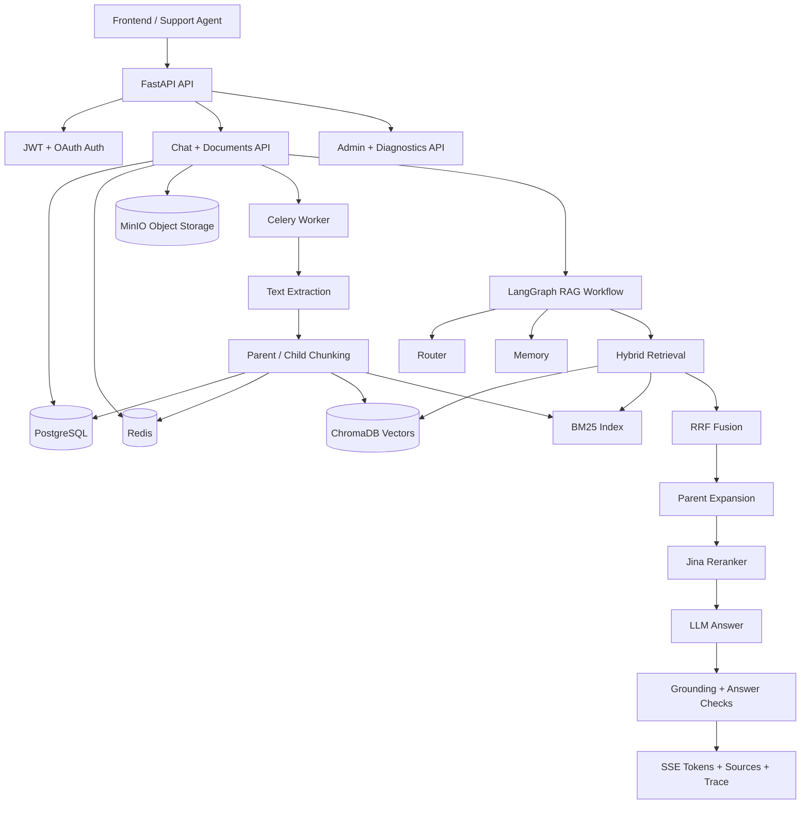

# SupportMind — Production-Grade RAG Backend for SaaS Support

<p align="center">
  
  
  
  
  
</p>

**SupportMind** is a production-oriented backend for support teams that need
fast, cited answers from internal knowledge-base documents. It combines
FastAPI, PostgreSQL, Redis, Celery, MinIO, ChromaDB, hybrid retrieval,
reranking, LangGraph self-correction, token-level SSE streaming, evaluations,
admin diagnostics, and production deployment docs.

This is not a minimal "chat with PDF" prototype. It is structured as a
backend/AI engineering portfolio project that demonstrates how a RAG service can
be built, tested, evaluated, operated, and deployed.

---

## Why This Exists

SaaS support teams answer repeated product, API, billing, integration, webhook,
and incident questions across scattered documentation. The usual failure modes
are slow lookup, inconsistent answers, and no source traceability.

SupportMind solves this by letting teams upload support knowledge-base documents
and ask natural-language questions. The backend retrieves relevant context,
ranks it, generates a grounded answer, streams the response, and returns source
metadata plus an `agent_trace` for debugging retrieval quality.

---

## Feature Matrix

| Area | Capability |
| :--- | :--- |
| **Auth** | Email registration, OTP/link verification, login, refresh, logout, Google OAuth, onboarding. |
| **User lifecycle** | Profile endpoints, soft-delete-aware auth, verified/onboarded access gates. |
| **Documents** | Conversation-scoped uploads, MinIO storage, Celery ingestion, status polling, cleanup. |
| **RAG retrieval** | Parent-child chunking, OpenAI embeddings, ChromaDB vector search, BM25 lazy rebuild, RRF fusion, Jina reranking. |
| **Agent workflow** | LangGraph routing, memory loading, retrieval, relevance grading, answer generation, hallucination checks, bounded retries. |
| **Streaming** | `text/event-stream` status, token, sources, trace, done, and error events. |
| **Observability** | Agent trace metadata, retrieval timing, citation trace, `/ready`, admin-only diagnostics, Celery and ingestion visibility. |
| **Admin** | User/document/quota/settings management, document retry/delete, system stats, diagnostics. |
| **Quality** | CI-safe API/service/RAG/eval/config tests, live-service integration tests, offline and live API eval modes. |
| **Deployment** | Dockerized infra, production compose overlay, non-root Docker image, production config guardrails, runbooks. |

---

## Architecture at a Glance



Detailed architecture and demo docs:

- [DEMO_SCRIPT.md](file:///d:/DL/rag-backend/rag-backend/docs/DEMO_SCRIPT.md) — 5-minute demo script
- [DEMO_EVIDENCE.md](file:///d:/DL/rag-backend/rag-backend/docs/DEMO_EVIDENCE.md) — Live demo certification evidence
- [ARCHITECTURE_OVERVIEW.md](file:///d:/DL/rag-backend/rag-backend/docs/ARCHITECTURE_OVERVIEW.md) — Portfolio-friendly architecture overview
- [architecture.md](file:///d:/DL/rag-backend/rag-backend/docs/architecture.md)

---

## RAG Pipeline

### Ingestion

```text
Upload support document
→ Store original file in MinIO
→ Queue Celery ingestion job
→ Extract text
→ Build parent and child chunks
→ Store metadata/chunks in PostgreSQL
→ Cache parent chunks in Redis
→ Embed child chunks into ChromaDB
→ Mark document ready or failed
```

### Query

```text
User asks support question
→ Rate limit and quota checks
→ Router classifies intent
→ Memory loads conversation history
→ Conversation-scoped query cache lookup
→ Lazy rebuild BM25 in API process when needed
→ BM25 + vector retrieval
→ Reciprocal Rank Fusion
→ Parent expansion
→ Jina reranking
→ Stream answer tokens over SSE
→ Validate grounding and answer quality
→ Record retrieval timing, citation trace, and evaluator failure mode
→ Persist messages and agent trace
→ Emit sources, trace, and done events
```

---

## Demo Flow

The sample knowledge base in [sample_docs](file:///d:/DL/rag-backend/rag-backend/sample_docs)
contains mock SaaS support documents for API auth, billing, webhooks,
integrations, release notes, and incidents.

Suggested demo questions:

- “How do I rotate an API key?”
- “Why am I getting a 401 error?”
- “Which plan supports SSO?”
- “What are the webhook retry rules?”
- “How do I troubleshoot failed Stripe integration?”

Use [DEMO_SCRIPT.md](file:///d:/DL/rag-backend/rag-backend/docs/DEMO_SCRIPT.md)
for a 5-minute walkthrough.

---

## API Overview

| Group | Examples |
| :--- | :--- |
| **Auth** | `POST /api/v1/auth/register`, `POST /api/v1/auth/login`, `POST /api/v1/auth/refresh`, `POST /api/v1/auth/exchange-code` |
| **Users** | `GET /api/v1/users/me`, `PATCH /api/v1/users/me`, `POST /api/v1/users/me/change-password` |
| **Chat** | `POST /api/v1/chat/conversations`, `GET /api/v1/chat/conversations/{id}`, `POST /api/v1/chat/conversations/{id}/message` |
| **Documents** | `POST /api/v1/chat/conversations/{id}/documents`, `GET /api/v1/chat/conversations/{id}/documents/{doc_id}` |
| **Admin** | `GET /api/v1/admin/users`, `GET /api/v1/admin/documents`, `POST /api/v1/admin/documents/{id}/retry`, `GET /api/v1/admin/stats` |
| **Diagnostics** | `GET /health`, `GET /ready`, `GET /api/v1/admin/diagnostics` |

Full endpoint matrix:

- [API_CAPABILITIES.md](file:///d:/DL/rag-backend/rag-backend/docs/API_CAPABILITIES.md)

---

## Chat SSE Event Contract

`POST /api/v1/chat/conversations/{id}/message` returns `text/event-stream` frames:

```text
event: status
data: {"type":"status","stage":"retrieval","retry_count":0}

event: token
data: {"type":"token","content":"SupportMind","retry_count":0}

event: sources
data: {"type":"sources","sources":[...]}

event: trace
data: {"type":"trace","agent_trace":{...}}

event: done
data: {"type":"done","sources":[...],"token_count":123,"retry_count":0}
```

Errors are emitted as:

```text
event: error
data: {"type":"error","message":"An error occurred."}
```

Manual streaming test:

```bash
curl -N \
  -H "Authorization: Bearer $ACCESS_TOKEN" \
  -H "Content-Type: application/json" \
  -X POST "http://localhost:8000/api/v1/chat/conversations/$CONVERSATION_ID/message" \
  -d '{"query":"How do I rotate an API key?"}'
```

Frontend clients should append `token` event content to the visible answer,
display `status` retry events as progress indicators, and render `sources` and
`trace` after `done`.

---

## Quick Start

### 1. Install dependencies

```bash
python -m venv .venv
.venv\Scripts\activate
pip install -r requirements.txt -r requirements-dev.txt
```

### 2. Configure environment

```bash
copy .env.example .env
```

Update `.env` with OpenRouter, OpenAI-compatible embedding, Jina, database,
Redis, MinIO, and JWT values.

### 3. Start infrastructure

```bash
docker compose up -d
```

### 4. Run migrations

```bash
alembic upgrade head
```

### 5. Start API and worker

Start the API:

```bash
uvicorn app.main:app --reload
```

Start the Celery worker in a second terminal. On Windows, use `--pool=solo`:

```bash
celery -A app.tasks.celery_app worker -Q default,ingestion,email --pool=solo -l INFO
```

Open API docs at: <http://localhost:8000/docs>

### 6. Run the demo smoke workflow

After the API and worker are running, execute the reusable smoke script:

```bash
python scripts/demo_smoke.py
```

The script seeds a verified/onboarded local demo user, logs in through the API,
creates a conversation, uploads sample documents, waits for ingestion, asks the
standard demo questions over SSE, and verifies answer tokens, sources, and
agent trace events.

For detailed local setup, see [LOCAL_RUN_GUIDE.md](file:///d:/DL/rag-backend/rag-backend/docs/LOCAL_RUN_GUIDE.md).

---

## Evaluation

The [eval](file:///d:/DL/rag-backend/rag-backend/eval) directory contains a
CI-safe offline evaluator and an optional live API evaluator.

Offline eval:

```bash
python eval/run_eval.py --mode offline --output-dir eval/results --top-k 5
```

Live API eval:

```bash
python eval/run_eval.py --mode live-api \
  --api-base-url http://localhost:8000 \
  --email eval-user@example.com \
  --password EvalPassword123! \
  --sample-docs sample_docs \
  --output-dir eval/results
```

Tracked metrics include source hit rate, keyword coverage, citation rate,
fallback accuracy, latency, hallucination flags, and self-correction rate.

---

## Testing and CI

Fast checks that do not require external infrastructure:

```bash
python -m pytest --confcutdir=tests/config tests/config/test_settings_validation.py -q
python -m pytest --confcutdir=tests/api tests/api/test_health_api.py tests/api/test_sse.py tests/api/test_chat_streaming.py tests/api/test_admin_diagnostics.py -q
python -m pytest --confcutdir=tests/services tests/services/test_health_service.py tests/services/test_diagnostics_service.py -q
python -m pytest --confcutdir=tests/rag tests/rag/test_graph_routing.py tests/rag/test_evaluation.py tests/rag/test_integration.py tests/rag/test_ai_hardening.py -q
python -m pytest --confcutdir=tests/eval tests/eval/test_eval_metrics.py tests/eval/test_live_api_eval.py -q
```

Targeted lint used by CI:

```bash
python -m ruff check app/main.py app/config.py app/agents app/services/health_service.py app/services/diagnostics_service.py app/storage.py app/tasks/ingestion_tasks.py app/retrieval app/api/v1/chat.py app/api/v1/sse.py app/api/v1/admin.py eval/run_eval.py eval/live_api_eval.py eval/metrics.py eval/reporting.py tests/api/test_health_api.py tests/api/test_sse.py tests/api/test_chat_streaming.py tests/api/test_admin_diagnostics.py tests/api/conftest.py tests/rag/test_graph_routing.py tests/rag/test_evaluation.py tests/rag/test_integration.py tests/rag/test_ai_hardening.py tests/rag/conftest.py tests/services/test_health_service.py tests/services/test_diagnostics_service.py tests/services/conftest.py tests/eval/test_eval_metrics.py tests/eval/test_live_api_eval.py tests/config/test_settings_validation.py tests/integration
```

Live integration tests are opt-in and expect Postgres, Redis, ChromaDB, and
MinIO services:

```bash
set RUN_LIVE_INTEGRATION=1
python -m pytest --confcutdir=tests/integration tests/integration -q
```

---

## Deployment and Operations

Production-like deployment and operations docs:

- [DEPLOYMENT_GUIDE.md](file:///d:/DL/rag-backend/rag-backend/docs/DEPLOYMENT_GUIDE.md)
- [OPERATIONS_RUNBOOK.md](file:///d:/DL/rag-backend/rag-backend/docs/OPERATIONS_RUNBOOK.md)
- [BACKUP_RESTORE.md](file:///d:/DL/rag-backend/rag-backend/docs/BACKUP_RESTORE.md)
- [SECURITY_CHECKLIST.md](file:///d:/DL/rag-backend/rag-backend/docs/SECURITY_CHECKLIST.md)

Use [docker-compose.yml](file:///d:/DL/rag-backend/rag-backend/docker-compose.yml)
for development and combine it with
[docker-compose.prod.yml](file:///d:/DL/rag-backend/rag-backend/docker-compose.prod.yml)
for production-like validation.

```bash
docker compose config --quiet
docker compose -f docker-compose.yml -f docker-compose.prod.yml config --quiet
```

Admin diagnostics are available at:

```text
GET /api/v1/admin/diagnostics
```

This endpoint summarizes dependency health, Celery reachability, secret-safe
runtime config, and document ingestion status.

---

## Security and Reliability Highlights

- Production mode rejects placeholder JWT secrets, wildcard CORS, missing
  provider keys, and default MinIO credentials.
- CORS uses explicit origins instead of wildcard credentials.
- Refresh tokens are accepted through request bodies, not query parameters.
- OAuth/email redirects use short-lived one-time exchange codes.
- Soft-deleted users are blocked by auth dependencies and login flows.
- Parent chunk DB fallback is scoped by conversation to prevent data leakage.
- Admin diagnostics are admin-only and secret-safe.
- Docker runtime uses a non-root app user.
- Production compose overlay removes reload/bind mounts and keeps infra ports
  internal by default.

---

## What This Project Demonstrates

- Production-style FastAPI backend architecture
- Async SQLAlchemy and service-layer design
- Auth, OAuth, token refresh, onboarding, and admin authorization
- Background ingestion with Celery and Redis
- Object storage with MinIO
- Hybrid RAG retrieval beyond vector-only search
- Parent-child chunking, RRF, reranking, and self-correction loops
- Token-level SSE streaming and client-facing event contracts
- Evaluation tooling for offline and live API RAG quality
- CI-safe tests plus opt-in live integration tests
- Deployment, operations, backup/restore, and security documentation

---

## Roadmap

Recommended next steps:

- Deploy to a real staging target and run live smoke tests.
- Add a small UI/admin dashboard on top of the diagnostics endpoint.
- Add richer eval dashboards and longitudinal retrieval quality tracking.
- Add atomic quota updates with Redis Lua or database row locks for high load.
- Add OpenTelemetry traces if moving beyond portfolio/demo scope.