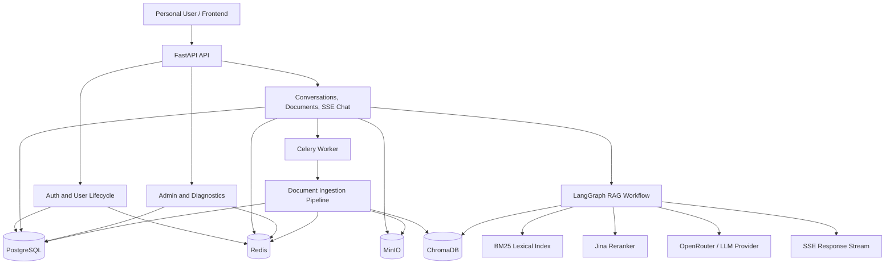
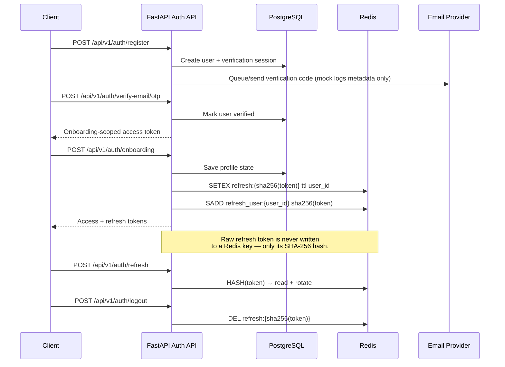
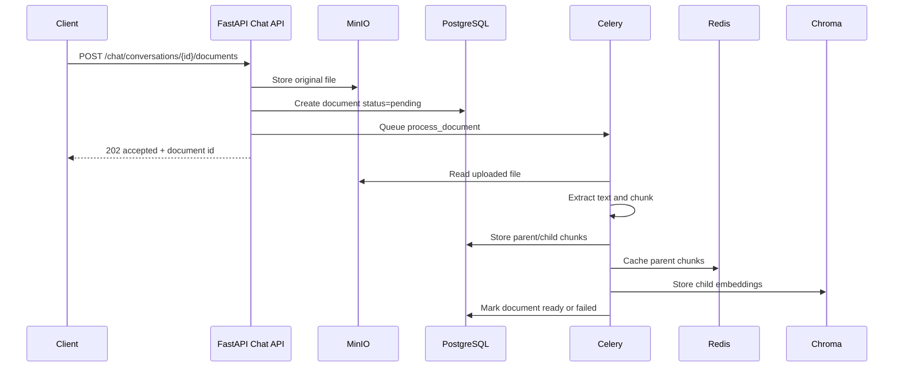
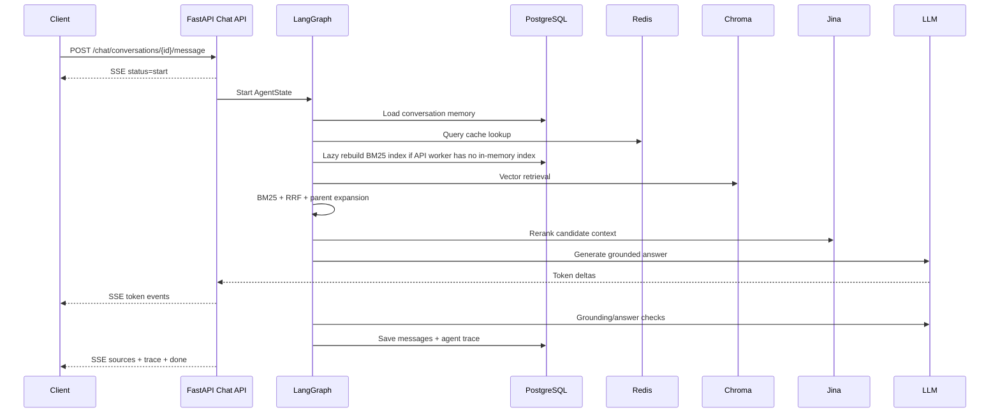
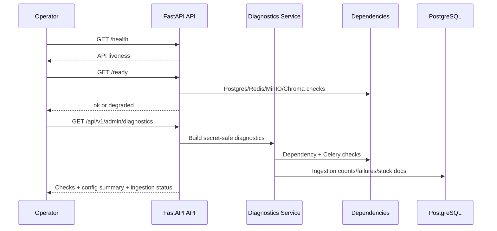

# Architecture Overview

This document summarizes the production-style backend architecture for
MindLayer. For detailed LangGraph node behavior, see
[architecture.md](file:///d:/DL/rag-backend/rag-backend/docs/architecture.md).

## System Context

## Core Components

| Component | Role |
| :--- | :--- |
| **FastAPI** | HTTP API for auth, users, chat, documents, admin, health, and readiness. |
| **PostgreSQL** | Durable relational data: users, conversations, documents, chunks, messages, quotas, settings, audit logs. |
| **Redis** | Rate limiting, refresh token/session state, parent chunk cache, Celery broker/backend. |
| **Celery** | Background document ingestion and scheduled quota reset tasks. |
| **MinIO** | Object storage for uploaded source documents. |
| **ChromaDB** | Vector database for child chunk embeddings. |
| **BM25** | Lexical retrieval over parent chunks. |
| **Jina Reranker** | Cross-encoder reranking for final context precision. |
| **LangGraph** | Agent workflow orchestration and corrective RAG routing. |
| **OpenRouter / LLM** | Answer generation and agent reasoning. |

## Request Flows

### Authentication Flow

### Document Ingestion Flow

### Chat/RAG Flow

## AI Runtime Hardening

- BM25 indexes are in-memory per process, so API workers lazily rebuild missing
  indexes from PostgreSQL before lexical search. This keeps hybrid retrieval
  effective even when Celery ingestion built BM25 in a separate worker process.
- Retrieval query cache keys are conversation-scoped and invalidated on document
  upload, delete, ingestion success, and ingestion failure.
- `agent_trace` includes retrieval cache mode, BM25 rebuild metadata, BM25/vector
  result counts, parent expansion counts, citation status, answer latency, and
  retrieval timing breakdowns.
- Embeddings are batched with `EMBED_BATCH_SIZE` to avoid provider request-size
  limits while preserving output order.
- `EVALUATOR_FAILURE_MODE` controls grader failures:
  - `warn_only` / `fail_open`: keep answers flowing and trace evaluator errors.
  - `fail_closed`: treat evaluator errors as unsafe/irrelevant for stricter use.

### Operations Flow

## Data Boundaries

- Conversations and documents are scoped by authenticated user.
- Parent chunk fallback retrieval is scoped by conversation to avoid cross-user
  context leakage.
- Admin APIs require `require_admin`.
- Diagnostics excludes secrets such as JWT keys, provider API keys, database
  URLs, Redis URLs, MinIO secrets, access tokens, and refresh tokens.
- Refresh tokens are never written to Redis in raw form: the key suffix is
  always the SHA-256 hash of the token, and a per-user index set is the
  source of truth for revocation.
- The email mock only logs metadata (recipient, subject, body length). The
  full HTML body — which contains OTP and password-reset tokens — is
  opt-in via `EMAIL_MOCK_VERBOSE=True` for dev environments.

## Sources

- A `Source` row describes a connected account or feed (`google_drive`,
  `notion`, `gmail`, `web_clipper`, `rss`, ...).
- `POST /api/v1/sources/{id}/sync` delegates to
  `SourceSyncService.sync(source)`, which dispatches the registered
  connector, dedupes items by `(source_id, source_ref)`, persists new
  Memory rows, and updates `Source.status` / `last_sync_at`.
- Failures surface as `Source.status = "error"` with
  `Source.sync_error` populated, never as an unhandled 500.

## Reliability and Deployment Boundaries

- Local development uses [docker-compose.yml](file:///d:/DL/rag-backend/rag-backend/docker-compose.yml).
- Production-like validation overlays [docker-compose.prod.yml](file:///d:/DL/rag-backend/rag-backend/docker-compose.prod.yml).
- Production mode rejects unsafe placeholder config at startup.
- `/ready` is a dependency readiness gate.
- `/api/v1/admin/diagnostics` is an authenticated operator view.
- Offline eval is deterministic and CI-safe; live API eval is opt-in.
- BM25 runtime consistency, query cache invalidation, citation trace, and timing
  metadata are part of the AI runtime hardening layer.
