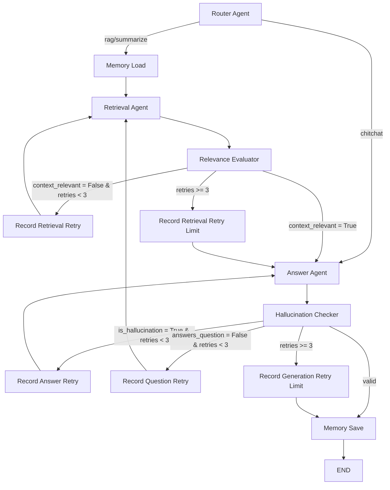

# Multi-Agent RAG Architecture

This document outlines the architecture of the Retrieval-Augmented Generation (RAG) system. The system has evolved from a linear pipeline into an advanced **Multi-Agent Corrective RAG (Self-RAG)** architecture using LangGraph.

## Core Concepts

The architecture relies on a state machine (LangGraph) where specialized agents perform distinct roles in the RAG process. The system is designed to be **reflective and self-correcting**, meaning it evaluates its own intermediate outputs and can loop back to correct mistakes (e.g., poor retrieval or hallucinations) before returning a final answer to the user.

## Agent State (`AgentState`)

The state shared across all agents during a single execution graph contains:
- **Input/Context**: `user_id`, `conversation_id`, `query`, `history`.
- **Routing & Control**: `query_type` (rag, chitchat, summarize), `should_stream`, `has_documents`.
- **Retrieval Data**: `bm25_results`, `vector_results`, `fused_chunks` (merged raw chunks), and `reranked_chunks` (final compressed/reranked parent chunks).
- **Evaluation Flags**: `context_relevant`, `is_hallucination`, `answers_question`, `retry_count`.
- **Output**: `response`, `token_count`, `agent_trace` (audit trail).

## Agent Pipeline & Nodes

### 1. Router Agent (`router`)
Determines the intent of the user's query (`rag`, `summarize`, or `chitchat`). This skips the expensive RAG process for simple greetings or direct summarization requests.

### 2. Memory Load Agent (`memory`)
Loads the conversation history to provide conversational context for query rewriting and answering.

### 3. Retrieval Agent (`retrieval`)
Executes a highly optimized Advanced RAG retrieval pipeline:
1. **Query Processing**: Rewrites the query, generates multiple query variants (Multi-Query), and creates a Hypothetical Document Embedding (HyDE).
2. **Hybrid Search**: Executes BM25 (keyword) and Vector (semantic) searches in parallel across all query variants.
3. **Reciprocal Rank Fusion (RRF)**: Merges and ranks the results from all search strategies.
4. **Parent-Child Expansion**: Maps the retrieved small "child" chunks back to their larger "parent" context blocks for better LLM comprehension.
5. **Jina Reranker**: Cross-encoder reranking of the expanded chunks to ensure the most relevant context is prioritized. Filters out chunks below a minimum relevance threshold (`MIN_RERANK_SCORE`).
6. **Contextual Compression**: Removes irrelevant sentences from the final chunks to save tokens and reduce noise.

### 4. Relevance Evaluator Agent (`grade_docs`) - *Critic*
Evaluates the `reranked_chunks` against the user's `query`.
- **Goal**: Prevent the Answer agent from generating an answer based on irrelevant context.
- **Output**: Sets `context_relevant` (True/False).

### 5. Answer Agent (`answer`) - *Generator*
Generates the final response using the user's query, conversation history, and the `reranked_chunks`.

### 6. Hallucination & Answer Checker Agent (`grade_gen`) - *Validator*
Evaluates the generated `response` against the retrieved `reranked_chunks` and the user's `query`.
- **Goal**: Ensure the answer is grounded in the provided facts (no hallucinations) and actually resolves the user's question.
- **Output**: Sets `is_hallucination` (True/False) and `answers_question` (True/False).

### 7. Memory Save Agent (`save`)
Saves the final query and response back to the conversation history.

## Graph Routing & Self-Correction Loops

The LangGraph wires these agents together with conditional edges that enable self-correction:

### Self-Correction Scenarios:
- **Irrelevant Context**: If `grade_docs` determines the retrieved documents don't contain the answer, the graph loops back to `retrieval` while incrementing `retry_count` and recording `agent_trace["correction"]`.
- **Hallucination Detected**: If `grade_gen` finds the Answer agent made up facts not in the context, it loops back to `answer` to force a regeneration.
- **Question Unanswered**: If the answer is factually grounded but fails to address the user's actual question, it loops back to `retrieval` to pull more relevant information.
- **Retry Limit**: All correction paths stop after 3 retries. The graph then records the retry-limit reason and proceeds to either `answer` or `save` with the safest available response.

## Technologies Used
- **Orchestration**: LangGraph, LangChain
- **LLM / Generation**: OpenRouter (configured for specific models)
- **Vector Database**: ChromaDB (Child chunk semantic search)
- **Keyword Search**: BM25Okapi (Parent chunk lexical search)
- **Reranking**: Jina Reranker API
- **Embeddings**: OpenAI-compatible Embeddings API (via OpenRouter)